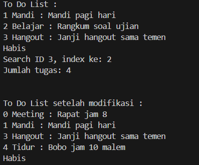

# To do list using linked list

## Penjelasan Singkat
Kode ini dirancang untuk mengelola sebuah daftar tugas atau bisa di sebut to-do list. Saya menggunakan linked list, cara kerjanya setiap tugas yg saya buat disimpan sebagai sebuah node. Node nya terdiri dari beberapa atribut yakni, id, nama, desc dan juga next. Semua node saling terhubung berkat adanya pointer dari next yg kemudian membentuk sebuah chain hingga selesai. 
Adapun beberapa fitur sesuai dengan kriteria tugas yakni insert di depan, insert di belakang, hapus berdasarkan id, cari berdasarkan id, tampilkan semua data, lalu yg terakhir hitung jumlah node

## Output Kode

## Analisis Big-O
| Operasi | Method | Big-O | Alasan |
|---|---|---|---|
| Tambah di awal | `insert_front` | O(1) | Langsung arahkan pointer ke head, tidak perlu traversal |
| Tambah di akhir | `insert_end` | O(n) | Harus traversal dari head sampai node terakhir |
| Hapus berdasarkan id | `delete` | O(n) | Harus traversal untuk mencari node sebelum target |
| Cari berdasarkan id | `search` | O(n) | Linear search dari head satu per satu |
| Tampilkan semua data | `traverse` | O(n) | Harus melewati setiap node satu per satu |
| Hitung jumlah node | `count` | O(n) | Harus melewati setiap node untuk menghitung |

